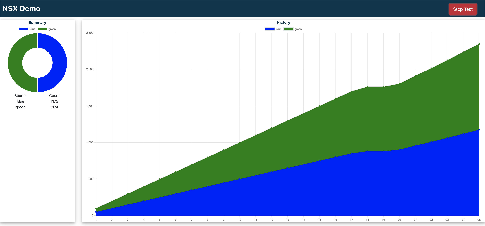

# Blue-Green Deployment / NSX ALB Demo



Simple UI to demonstract Blue Green deployment. 
When you have a single endpoint to access multiple version of the applicaiton and you are moving/dripping traffic from one instance (blue to green), see it happen visually.

## Prerequisites

- Docker
- kubectl
- Patience


## How to deploy

1. Deploy blue version on one environment
    1. Add an environment variable in the deployment: `CLUSTER=blue`
    1. Setup a env-specific endpoint
1. Deploy green version on another environment
    1. Add an environment variable in the deployment: `CLUSTER=green`
1. Setup a Global LB/DNS entry pointing to both envs
1. Deploy the client application on one of the environment and configure ingress
1. Goto client application

## Scratch space

```bash


kubectl apply -f https://projectcontour.io/quickstart/contour.yaml
kubectl create rolebinding envoy-privileged \
                                      --clusterrole=vmware-system-tmc-psp-privileged \
                                      --user=system:serviceaccount:projectcontour:envoy \
                                      -n projectcontour
kubectl rollout restart  daemonset.apps/envoy                   
kubectl apply -f https://github.com/jetstack/cert-manager/releases/download/v1.4.0/cert-manager.yaml


k create deployment green --image=ealen/echo-server:0.5.1 -o yaml --dry-run=client >  green.yaml
k create deployment blue --image=ealen/echo-server:0.5.1 -o yaml --dry-run=client >  blue.yaml


kubectl create rolebinding client-privileged \
--clusterrole=vmware-system-tmc-psp-privileged \
--user=system:serviceaccount:default:default \
-n default
```

## Credits

- [React ChartJS Dashboard](https://www.createwithdata.com/react-chartjs-dashboard/)
